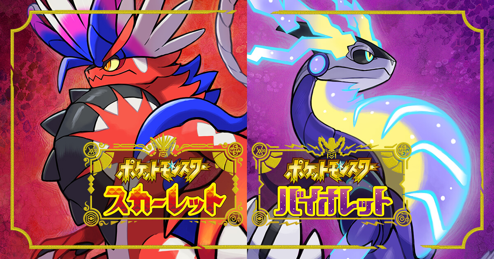

## 導入

ポケモン対戦歴 1 ヶ月程度の素人の考察だと思って優しい目で読んで頂けると嬉しいです。

ざっくりポケモン対戦において戦術パターンとして大きく以下のように分けられる。

1. 対面構築(1vs1 の殴り合いを 3 回制することで勝利を掴む)
1. サイクル構築(サイクルを回しながら対面有利を作り、相手を削っていく)
1. 展開構築(天候、壁、トリルなどのギミックからエースの積みにつなげ全抜きを狙う戦術)

## サイクル構築

サイクル構築において最も重要なのは、タイプ受けの優秀さであると考える。

現環境においてタイプ受けが優秀なポケモンのランキングは、以下の通り。

|      タイプ       | 半減数 | 弱点数 |             ex             |
| :---------------: | :----: | :----: | :------------------------: |
|   はがね/でんき   |   12   |   3    |         ジバコイル         |
|  はがね/ゴースト  |   12   |   4    |         サーフゴー         |
| はがね/フェアリー |   11   |   2    |        デカヌチャン        |
|    はがね/あく    |   11   |   3    |         ドドゲザン         |
|      はがね       |   11   |   3    |          ミミズズ          |
|   はがね/ひこう   |   10   |   2    |        アーマーガア        |
|    はがね/どく    |   10   |   2    |         ブロローム         |
|  はがね/エスパー  |   10   |   4    |         ドータンク         |
|   はがね/じめん   |   10   |   4    |        テツノワダチ        |
|    はがね/むし    |   9    |   1    |    ハッサム, フォレトス    |
|  はがね/かくとう  |   9    |   3    |          ルカリオ          |
|  ほのお/ゴースト  |   9    |   5    | ラウドボーン, ソウブレイズ |

はがねの弱点はほのお、かくとう、じめんの 3 タイプなので、

はがね複合+ドラゴン/ひこう(カイリュー or ボーマンダ)の組み合わせはかなり相性がいいと考えられる。

ほのお/ゴースト+くさ or かくとう or あくの組み合わせも良いだろう。

### ジバコイル軸(サイクル)

ジバコイルの弱点であるかくとう、じめん、ほのおをパートナーには補完してもらうのが良い。

ひこう、エスパー、フェアリーらへんが候補になるか。

2 体目にひこうを選択した場合、あくタイプのみ一貫性がないためバンギラスを選出し一貫性を担保。

- ☆ ジバコイル
- ボーマンダ
- バンギラス

### サーフゴー軸(サイクル)

サーフゴーのパートナーはふゆうサザンドラで確定。(2 体で全タイプ一貫性を持てる)

両方とも特殊アタッカーなので 3 体目は物理アタッカーを採用するのが良いか。

- ☆ サーフゴー
- ☆ サザンドラ
- セグレイブ

### アーマーガア軸(サイクル)

アーマーガアのパートナーはガブリアス一択。

残りの一貫性を保つために 3 体目の候補は以下。

メンツ的にステロあくびからの耐久戦術が良さそうか、パルシェンでどくびし撒いてもいいかも。

- ☆ アーマーガア
- ☆ ガブリアス
- ドヒドイデ

### ドドゲザン軸

- ☆ ドドゲザン
- ☆ ファイアロー

## 展開構築

自分がやってみたい展開としては、天気展開、壁展開、トリックパーティー or おいかぜ。

あとはステロまきびしどくびしでの耐久かな。

### 砂パ

- ☆ バンギラス
- ☆ ミミズズ
  - カイリュー or ボーマンダ
  - ガブリアス(粉)
  - ハカドッグ

### 雨パ

ハッサムは雨パで使うことで弱点を克服しつつ通していく。

かつ雨の恩恵を受けるかみなり or ぼうふう持ちのアタッカーを採用。

- ☆ ペリッパー
  - ハッサム
  - サンダース or ボーマンダ
  - イルカマン or ブロスター

### 晴れパ

- ☆ コータス
  - リーフィア
  - キラフロル or ラウドボーン or グレンアルマ

### 雪パ

- ☆ ヤドキング
  - グレイシア or セグレイブ
  - ルカリオ

### 壁パ

- ☆ オーロンゲ
  - コノヨザル
  - ボーマンダ

### バトンパ

### トリパ

- ☆ ゲンガー, エーフィ, エルレイド
  - ギャラドス、ドドゲザン、ストリンダー
